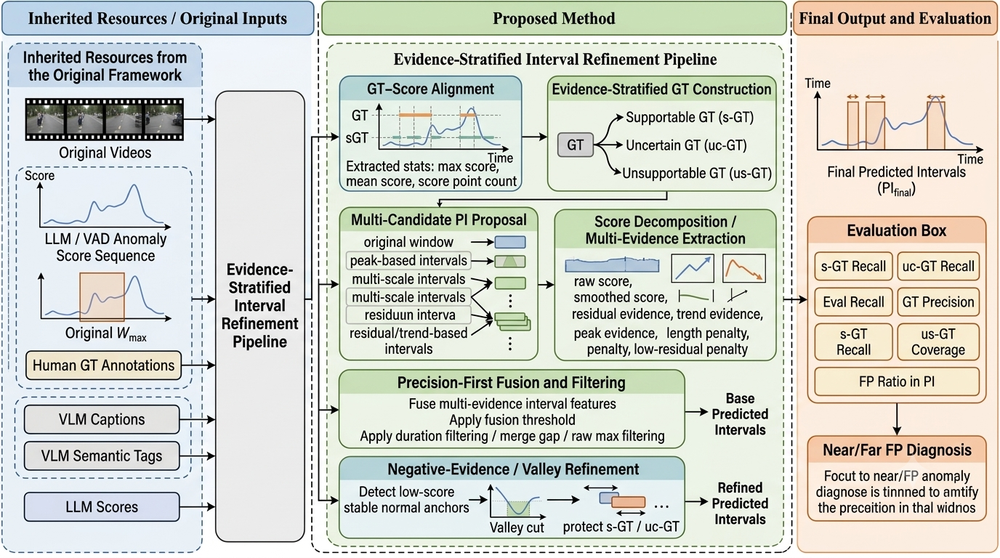
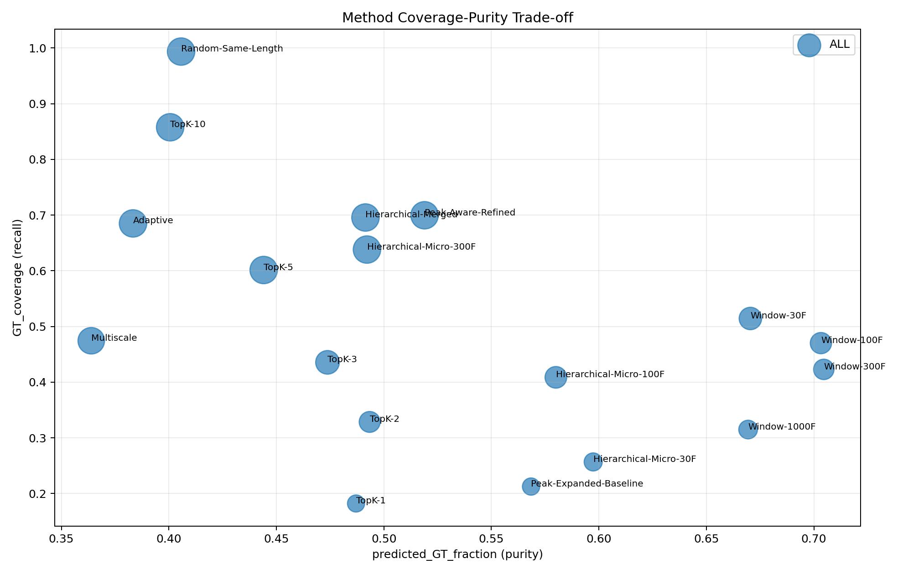
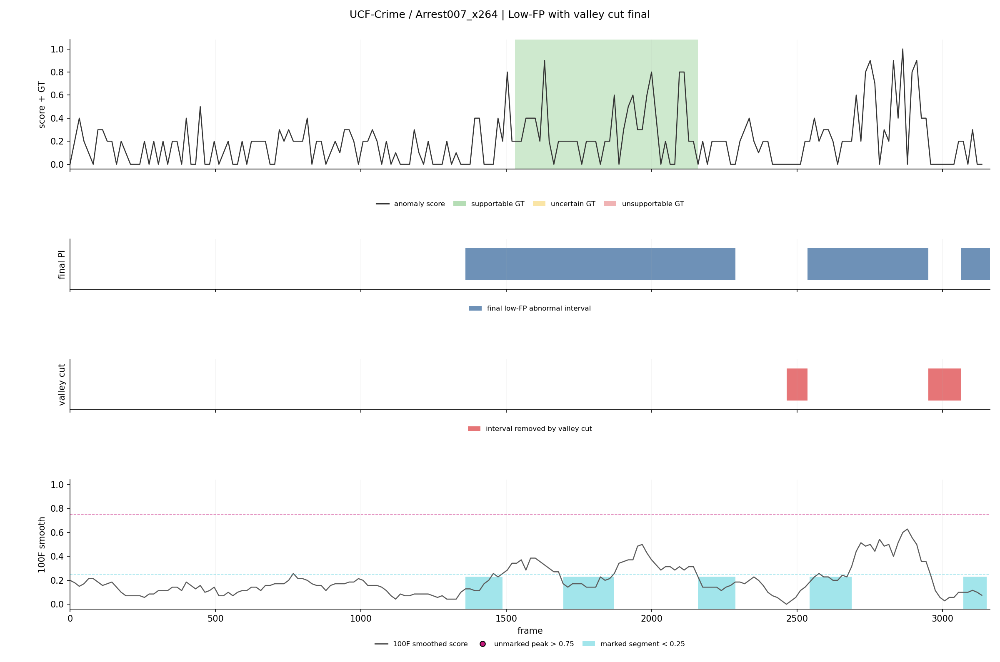
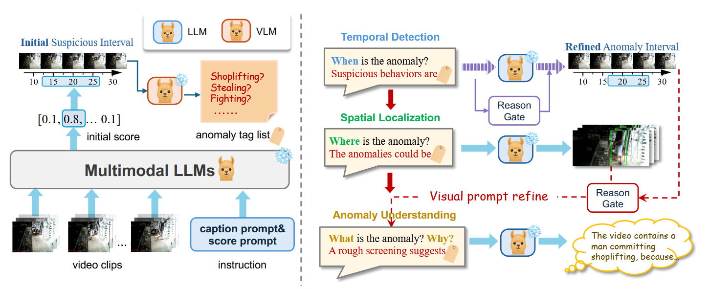

# SMILES.URF-HVAA

Evidence-stratified, low-false-positive interval refinement for zero-shot video anomaly analysis.

This repository builds on the original **URF-HVAA** codebase for holistic zero-shot video anomaly analysis and adds a score-to-interval refinement layer for more diagnostic temporal anomaly intervals. The added work focuses on a practical question that appears after a zero-shot VAD model has already produced frame or clip anomaly scores:

> Given a noisy anomaly-score curve, how should we turn it into reliable temporal anomaly intervals without retraining the VLM, LLM, or VAD scorer?

The current repository therefore contains two connected parts:

- The original holistic zero-shot video anomaly analysis pipeline: captioning, LLM-based anomaly scoring, temporal VAD evaluation, localisation priors, and anomaly-understanding outputs.
- The added **SpecVAD / evidence-stratified interval refinement** workflow: GT support stratification, multi-candidate interval generation, spectral score decomposition, precision-first fusion, negative-evidence valley cuts, ablations, scans, diagnostics, and visualisations.



## What This Project Adds

The original URF-HVAA temporal prior uses anomaly scores to identify suspicious video windows that can feed localisation and understanding modules. This project studies the interval-refinement problem more directly. In long videos, anomalies may be multi-part, GT intervals may be broad event-level spans, and anomaly scores often fire only around local key moments. A single high-average window can therefore miss multi-anomaly structure or over-expand into low-evidence regions.

The added refinement pipeline addresses this by:

- Stratifying GT intervals into score-supported, uncertain, and score-unsupported groups.
- Generating multiple interval candidates from peaks, windows, residuals, trends, and existing baselines.
- Decomposing anomaly scores into raw, smoothed, residual, trend, peak-count, length, and low-residual evidence.
- Selecting intervals with a precision-first fusion score.
- Applying lightweight negative-evidence / valley-cut post-processing to trim stable low-score normal anchors.
- Reporting frame-duration metrics rather than MSE-style score error.

The final low-FP configuration is intentionally a **precision-first operating point**, not a recall-optimal detector.

## Method Snapshot

The refinement protocol treats prediction as interval selection over an existing anomaly-score sequence:

```text
score curve
  -> candidate intervals
  -> multi-evidence interval features
  -> precision-first fusion
  -> low-FP base intervals
  -> negative-evidence valley cut
  -> final predicted intervals
```

Evaluation uses evidence-stratified GT:

- `s-GT`: score-supported GT intervals.
- `uc-GT`: uncertain but still evaluable GT intervals.
- `us-GT`: GT intervals not sufficiently supported by the current score curve; reported diagnostically, not used as the main recall denominator.

The main recall denominator is:

```text
GT_eval = s-GT union uc-GT
```

False positive duration is:

```text
FP = PI intersect non-GT
```

where `PI` is the predicted abnormal interval set.

## Key Results in the Current Workspace

The selected final configuration is `low_fp_with_valley_cut_final`.

| Metric | Value |
|---|---:|
| s-GT Recall | 0.705 |
| uc-GT Recall | 0.443 |
| Eval Recall | 0.696 |
| GT Precision | 0.552 |
| Eval Precision | 0.551 |
| FP Duration | 347264 |
| FP Ratio in PI | 0.448 |

Interpretation:

- `Low-FP with valley cut` is the recommended precision-first configuration for high-confidence interval reporting.
- Valley cut is a lightweight refinement: it removes a small amount of FP without changing displayed Eval Recall.
- Length penalty and low-residual penalty are the main FP-control modules.
- Residual and trend components are important for maintaining recall; removing them reduces FP mostly by predicting too little.
- Fusion threshold is the clearest recall-precision control knob.
- Near/far FP diagnostics show that remaining FP is not only GT-boundary spillover; at a 64-frame GT buffer, far-GT FP remains the larger share.

For details, see:

- `outputs/26-07-07-22-50-low-fp-ablation-scan/reports/low_fp_ablation_and_scan_report.md`
- `outputs/26-07-07-22-50-low-fp-ablation-scan/reports/near_far_fp_diagnostics.md`
- `outputs/26-07-08-11-15-low-fp-visualization/low-fp-visualization_report.md`



## Repository Layout

```text
.
├── src/                         # Original and local Python modules for VAD, VAL, VAU, scoring, filtering
├── scripts/                     # Reproduction, analysis, interval-refinement, scan, and plotting scripts
├── key_figs/                    # Figures used by the report and README
├── papers/                      # Draft method/report notes, including SMILES_2026.md
├── data/                        # Dataset annotations, videos, frames, captions, scores (not tracked)
├── outputs/                     # Generated experiment archives and visualisations
├── environment.yml              # Official-style conda environment
├── requirements.txt             # Python dependency list
└── .env.example                 # Environment-variable template
```

## Installation

The official environment targets Python 3.10, PyTorch 2.5, CUDA-capable packages, and large VLM/LLM dependencies.

```bash
conda env create -f environment.yml
conda activate VAA
```

Alternatively:

```bash
pip install -r requirements.txt
```

Some packages are platform-sensitive, especially `flash-attn`, `faiss-gpu`, `triton`, CUDA wheels, and large model runtimes. A Linux CUDA machine or WSL2 setup is recommended for full model-based reproduction. The lightweight synthetic demo can run without downloading the large models.

## Environment Variables

Copy the template if needed:

```bash
cp .env.example .env
```

Important variables:

- `OPENAI_API_KEY`: only required for GPT-based VAU text-quality scoring in `src/gpt_score_eval.py`.
- `HF_TOKEN`: optional, useful for gated Hugging Face downloads.
- `LLAMA31_8B_CKPT_DIR`: local Llama 3.1 8B Instruct checkpoint directory.
- `URF_HVAA_DATA_ROOT`: optional dataset root override.

Do not commit `.env`.

## Data Setup

The original pipeline expects preprocessed annotations, captions, scores, refined scores, and outputs under `data/`. Raw videos must be obtained from each dataset release and extracted into frames.

Expected layout:

```text
data/
  {dataset_name}/
    annotations/
    videos/
      {video_basename}.mp4
    frames/
      {video_basename}/
        000001.jpg
        000002.jpg
    captions/
    scores/
    refined_scores/
```

Datasets used by the scripts include:

- UCF-Crime: `data/ucf_crime`
- XD-Violence: `data/xd_violence`
- UBNormal: `data/UBNormal`
- MSAD: `data/MSAD`

The original URF-HVAA README described a Google Drive package with preprocessed annotation/caption/score artifacts. If those are available, caption generation and first-round scoring can be skipped.

## Model Setup

The original zero-shot framework uses:

- Video caption backbone: `DAMO-NLP-SG/VideoLLaMA3-7B`
- Text scoring/refinement model: Llama 3.1 8B Instruct original checkpoint

Expected Llama layout:

```text
libs/
  llama/
    llama/
      __init__.py
      ...
    llama3.1-8b/
      consolidated.00.pth
      params.json
      tokenizer.model
      ...
```

The expected SHA256 for `consolidated.00.pth`, following the original README, is:

```text
ab33d910f405204e5d388bc3521503584800461dc96808e287821dd451c1edac
```

## Quick Start: Synthetic Smoke Demo

Run the minimal demo without downloading the full datasets or large checkpoints:

```bash
python -m src.minimal_demo --output_dir outputs/minimal_demo
```

This writes a synthetic output package under:

```text
outputs/minimal_demo/
```

The demo is a format and pipeline smoke test. It is not a reproduction of official paper numbers.

## Original URF-HVAA Temporal VAD Workflow

After preparing videos, frames, annotations, captions, scores, and model checkpoints:

1. Precompute captions:

```bash
python ./src/video_pre_caption.py \
  --video_folder "./data/{dataset_name}/videos/" \
  --index_file "./data/{dataset_name}/annotations/test.txt" \
  --output_dir "./data/{dataset_name}/captions/{experiment_name}" \
  --interval 10
```

2. Run first-round VAD scoring:

```bash
bash scripts/query_llm_vad.sh
```

3. Extract suspicious high/low windows:

```bash
python ./src/score_filter.py
```

4. Extract anomaly tags:

```bash
python ./src/summarize_window.py
```

5. Refine scores:

```bash
bash scripts/refine_score.sh
```

6. Evaluate temporal VAD:

```bash
bash scripts/eval_ucf.sh
bash scripts/eval_xd.sh
bash scripts/eval_ub.sh
bash scripts/eval_msad.sh
```

You can also call `python -m src.eval` directly when using a custom dataset layout.

## Evidence-Stratified Interval Refinement Workflow

The local analysis scripts are designed to archive results under timestamped folders in `outputs/`.

Common entry points:

```bash
python scripts/analyze_gt_score_alignment.py
python scripts/run_spectral_score_decomposition.py
python scripts/run_spectral_param_scan.py
python scripts/run_spectral_ablation_study.py
python scripts/run_interval_evaluation_summary.py
python scripts/run_low_fp_ablation_and_scan.py
python scripts/update_low_fp_report_diagnostics.py
python scripts/plot_low_fp_visualization.py
```

The most recent low-FP archive in this workspace is:

```text
outputs/26-07-07-22-50-low-fp-ablation-scan/
```

It contains:

- `reports/low_fp_ablation_and_scan_report.md`
- `reports/low_fp_ablation_summary.csv`
- `reports/scan_*.csv`
- `reports/pi_interval_diagnostics_low_fp_with_valley_cut_final.csv`
- `reports/negative_evidence_diagnostics.csv`
- `reports/near_far_fp_diagnostics.csv`
- `reports/low_fp_examples/*.png`

The full visualization batch is:

```text
outputs/26-07-08-11-15-low-fp-visualization/
```

It contains 640 per-video plots with four rows:

1. anomaly score plus supportable / uncertain / unsupportable GT;
2. final low-FP abnormal intervals;
3. intervals removed by valley cut;
4. 100F smoothed score with unmarked high peaks and marked low-score portions.



## Figures

Useful figures are stored in `key_figs/`:

- `origin.png`: original unified reasoning framework.
- `SpecVAD.png`: evidence-stratified interval-refinement pipeline.
- `fig_method_gt_coverage_vs_purity.png`: coverage-purity trade-off.
- `fig_param_sensitivity_fusion_threshold.png`: fusion-threshold sensitivity.
- `fig_recall_vs_strict_tradeoff.png`: recall versus stricter score trade-off.
- `fig_recoverable_upper_bound.png`: recoverability limit of score-only post-processing.



## Metrics

Original `src/eval.py` reports:

- frame-level ROC AUC;
- frame-level PR AUC;
- optimal ROC threshold by Youden's J;
- optimal PR/F1 threshold;
- max F1.

The interval-refinement analysis reports duration-based metrics:

- `PI Duration` and `PI Ratio`;
- `s-GT Recall`, `uc-GT Recall`, and `Eval Recall`;
- `GT Precision` and `Eval Precision`;
- `us-GT Coverage`;
- `FP Duration` and `FP Ratio in PI`;
- negative-evidence diagnostics such as `FP Removed by NI`, `TP Lost by NI`, and `NI-over-sGT Ratio`;
- near-GT versus far-GT FP diagnostics.

## Notes and Limitations

- This repository includes both original framework code and local research scripts. Some generated outputs are large and are intentionally kept under `outputs/`.
- The low-FP final configuration is not a maximum-recall method. It is meant for lower-false-positive, higher-confidence interval reporting.
- Score-to-interval post-processing cannot recover GT intervals for which the underlying anomaly score has no response.
- Remaining false positives include far-from-GT regions, so they cannot be explained only as GT-boundary spillover.
- Negative-evidence valley cutting is protected by `protect_sgt_ucgt=True` because stable low-score regions can still touch score-supported or uncertain GT.

## Citation

Original framework:

```bibtex
@inproceedings{
lin2025AUR,
title={A Unified Reasoning Framework for Holistic Zero-Shot Video Anomaly Analysis},
author={Dongheng Lin, Mengxue Qu, Kunyang Han, Jianbo Jiao, Xiaojie Jin, Yunchao Wei},
booktitle={The Thirty-ninth Annual Conference on Neural Information Processing Systems},
year={2025},
url={https://openreview.net/forum?id=Qla5PqFL0s}
}
```

If you use the evidence-stratified interval-refinement additions, please cite the corresponding project report or paper draft when available.
