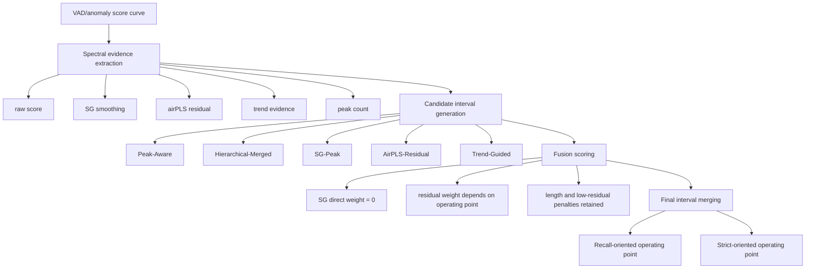

# System Structure

```mermaid
flowchart TD
  A["VAD/anomaly score curve"] --> B["Spectral evidence extraction"]
  B --> B1["raw score"]
  B --> B2["SG smoothing"]
  B --> B3["airPLS residual"]
  B --> B4["trend evidence"]
  B --> B5["peak count"]
  B --> C["Candidate interval generation"]
  C --> C1["Peak-Aware"]
  C --> C2["Hierarchical-Merged"]
  C --> C3["SG-Peak"]
  C --> C4["AirPLS-Residual"]
  C --> C5["Trend-Guided"]
  C --> D["Fusion scoring"]
  D --> D1["SG direct weight = 0"]
  D --> D2["residual weight depends on operating point"]
  D --> D3["length and low-residual penalties retained"]
  D --> E["Final interval merging"]
  E --> F["Recall-oriented operating point"]
  E --> G["Strict-oriented operating point"]
```
